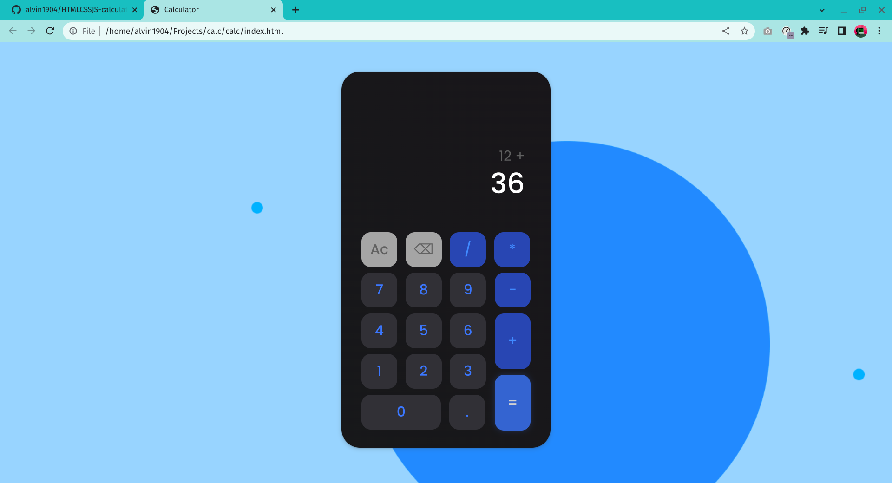
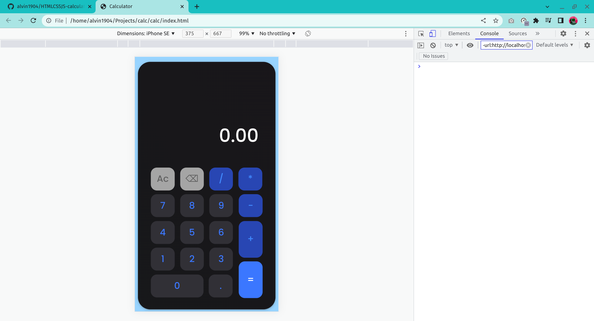

# Modern Calculator

This app is a modern-day calculator with an advanced and attractive interface designes with no CSS frameworks.

## Features

- View the optimal layout for the site depending on their device's screen size
- Calculate operations and produce result upto 10 places of decimal.

## Tech Stack

**Client:** HTML, plain CSS, Vanilla JS

**Server:** N/A

## Screenshots

 

 

 

